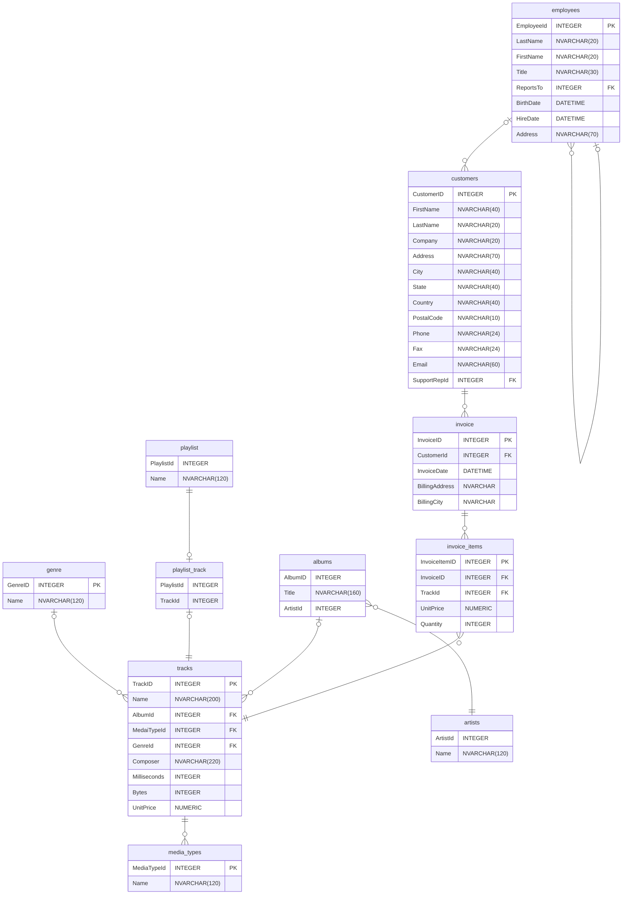

# Example

This examles work with a SQL sample database called `Chinook` that can be for example [here](https://www.sqlitetutorial.net/sqlite-sample-database/).

This database consists of the following tables:



## Basic Comparison between Raw SQL and `QueryWeaver`'s Query

The following comparison shows a raw SQL query and a corresponding python query made with `QueryWeaver`

=== "Raw SQL Query"

    ```sql
    SELECT
        artists.ArtistId AS 'ID',
        artists.Name AS 'Bandname',
        COUNT(albums.AlbumId) AS '# Albums'
    FROM artists
    INNER JOIN albums
        ON (artists.ArtistId = albums.ArtistId)
    GROUP BY artists.ArtistId
    HAVING (COUNT(albums.AlbumId) >= 10)
    ORDER BY COUNT(albums.AlbumId) DESC
    LIMIT 5
    ```

=== "QueryWeaver"

    ```py
    from queryweaver import SQLQueryBuilder

    with SQLQueryBuilder("examples/chinook.db") as db:
        albums = db.schema.albums
        artists = db.schema.artists

        query = (
            db.select(
                artists.ArtistId.alias("ID"),
                artists.Name.alias("Bandname"),
                albums.AlbumId.count().alias("# Albums"),
            )
            .from_table(artists)
            .join(albums, on=artists.ArtistId == albums.ArtistId)
            .group_by(artists.ArtistId)
            .having(albums.AlbumId.count() >= 10)
            .order_by(albums.AlbumId.count(), ascending=False)
            .limit(5)
        )

        print(query.to_pandas())
    ```

## Output

| ID  | Bandname     | # Albums |
| --- | ------------ | -------- |
| 90  | Iron Maiden  | 21       |
| 22  | Led Zeppelin | 14       |
| 58  | Deep Purple  | 11       |
| 50  | Metallica    | 10       |
| 150 | U2           | 10       |
